build-lists: true


---

# [fit] Bad People, 

# [fit] Bad Computers

by __@tcburning__

---


---

#THROWBACK: CS 101

---

```python
number = random.randint(1, 10)
guess = int(input('Guess a number 1-10. If you are right, you win a million bucks: '))
if (guess == number):
  print("Omg, you win a million bucks! Ask someone in the audience for it.")
else
  print("Awkward...")
```

---

```python
Guess a number 1-10. If you are right, you win a million bucks: 20
```

---

```python
if (guess > 10 or guess < 1):
  print("Make sure your guess is between 1 and 10, inclusive")
elif (guess == number):
  print("Omg, you win a million bucks! Ask someone in the audience for it.")
else
  print("Awkward...")
```

---

```python
Guess a number 1-10. If you are right, you win a million bucks: two
```

---

```python
while True:
  try:
    guess = int(input('Guess a number 1-10. If you\'re right, you win a million bucks: '))
    break
  except NameError:
    print("Oops! Make sure you enter a number, not a word.")
```
---

__What if:__

- Someone can't see the screen?

- Someone can only count to five?

- Someone doesn't know how to interact with a computer?

---


---

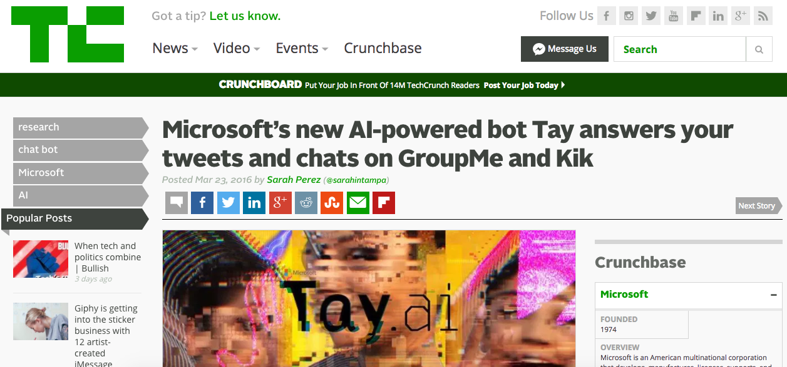

---

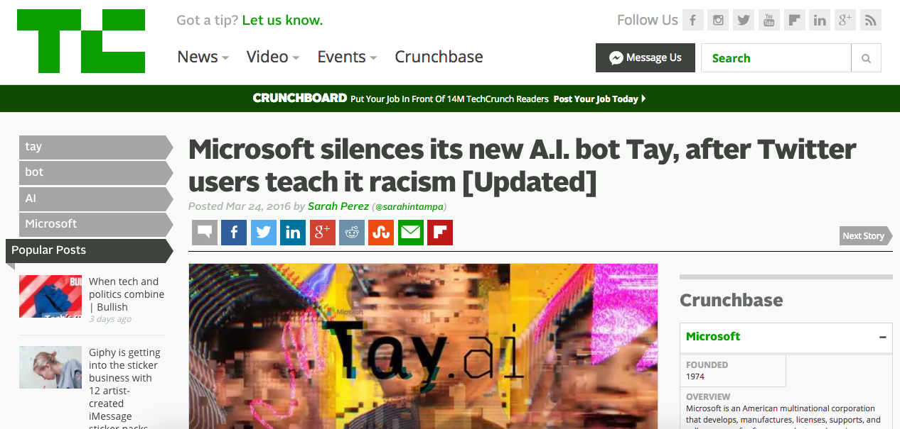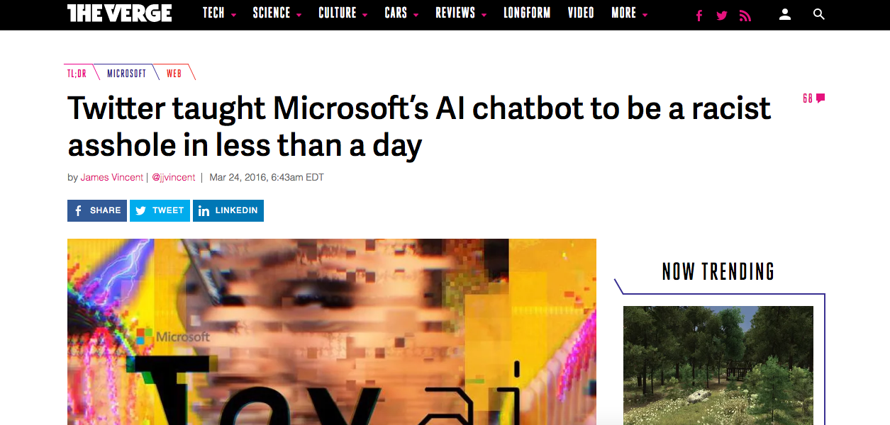
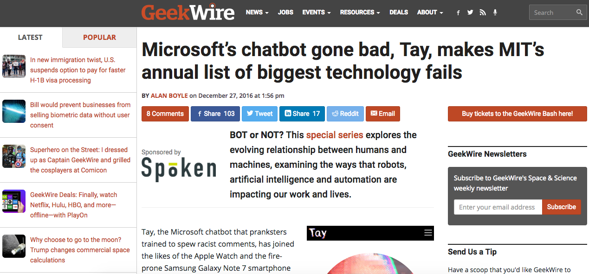

---

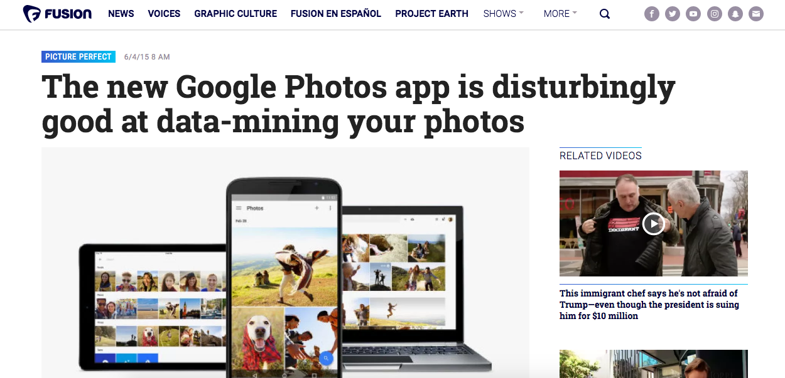

---

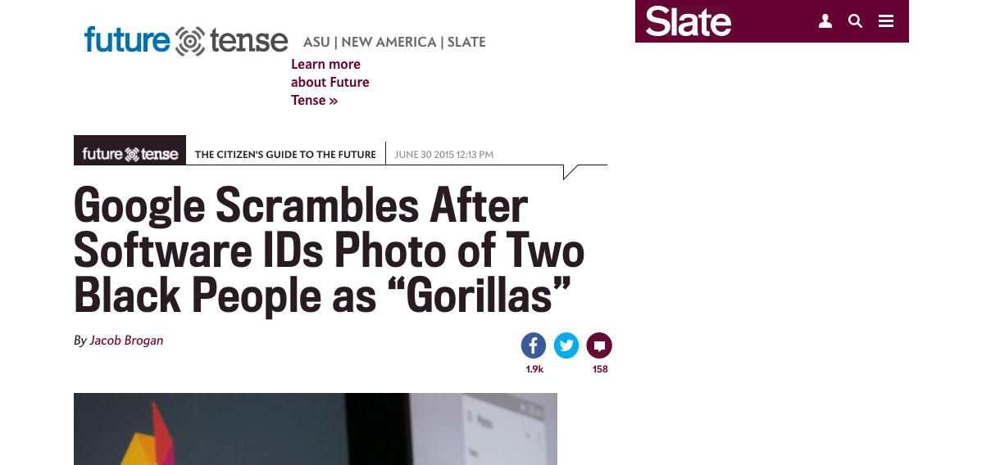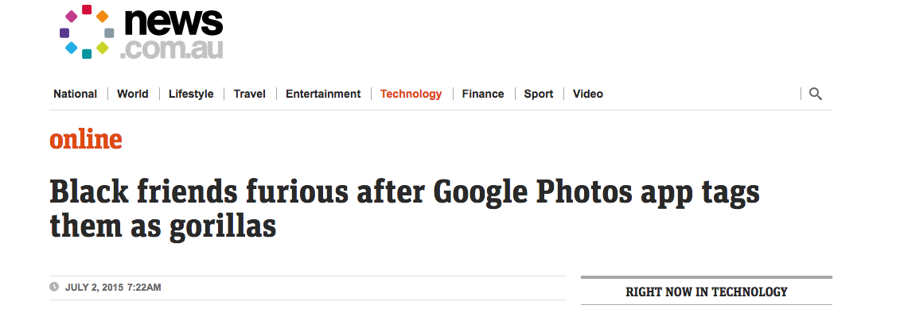
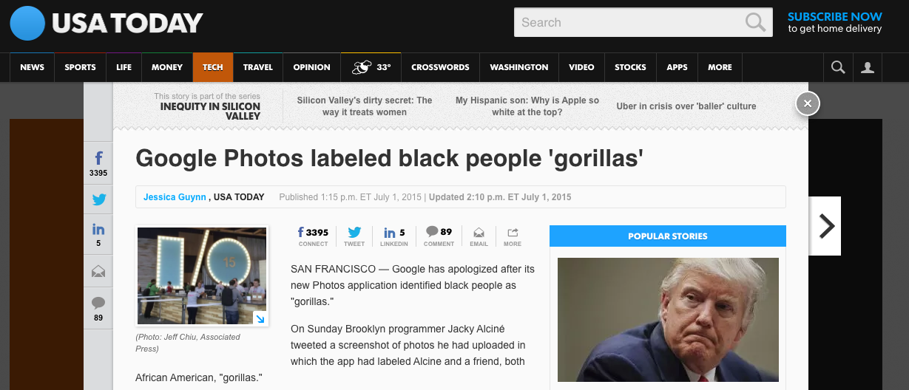

---


---

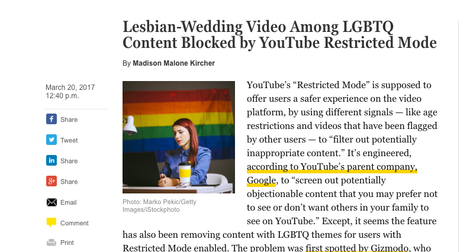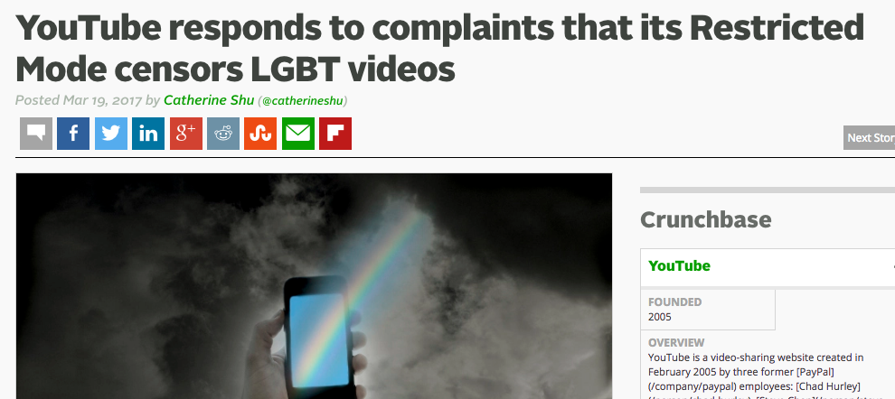
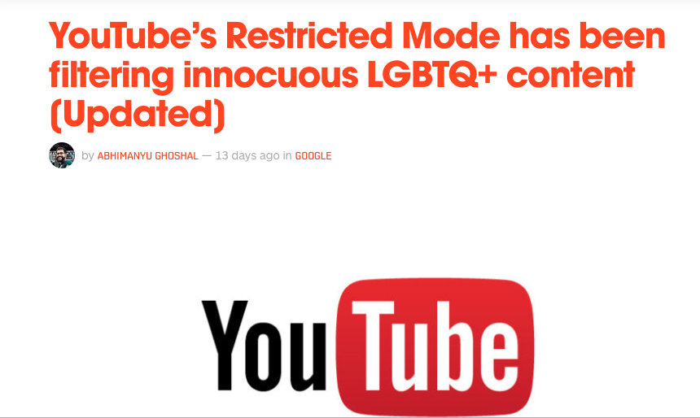

---

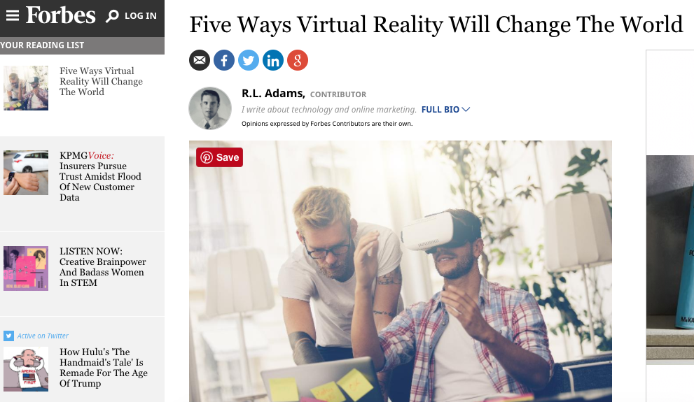

---

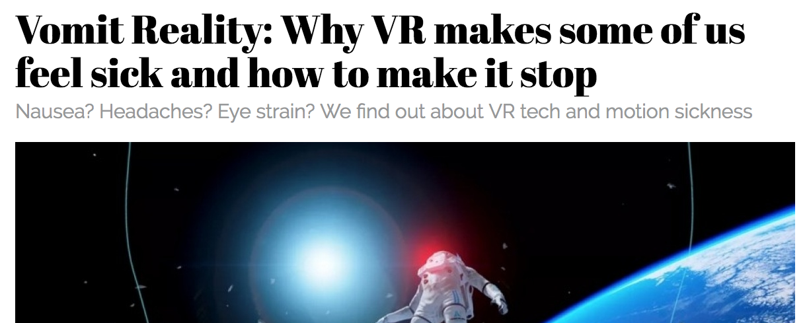
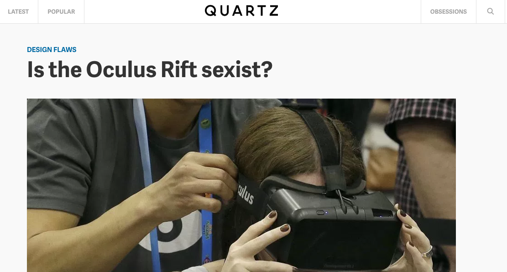

---


###Is an algorithm any less racist than a human?

"...any algorithm can – and often does – simply reproduce the biases inherent in its creator, in the data it’s using, or in society at large. For example, Google is more likely to advertise executive-level salaried positions to search engine users if it thinks the user is male... While Harvard researchers found that ads about arrest records were much more likely to appear alongside searches for names thought to belong to a black person versus a white person...

---

"These aren’t necessarily malicious situations – it’s not that Google is staffed by sexists, for example, but rather that the algorithm is just mirroring the existing gender pay gap. But in so doing, the algorithm reinforces that gap, and as long as we continue to believe an algorithm is an “unbiased” machine, we risk reinforcing the status quo in harmful ways." 

__- The Guardian__

---


> "You better check yo self before you wreck yo self"

__- Ice Cube: Highly respected prophet and software engineer__

---

Be cognizant of implicit bias...

... and how that Manifests in Code

(in other words, check your privilege)

---

The vast majority of us have privilege! For example...

- Please pay $5 to play this game.

- Please enter the college you attended to confirm your identity.

- Please enter your manager's contact info to verify your work history.

---

###Be Cognizant of Programming Bias

#### Emacs vs Vi/Vim

#### AngularJS vs React

#### Cassandra vs MongoDB

#### Server-side vs client-side

#### Java vs C++

and so on

---

###Diverse teams, companies, thoughts, backgrounds, music tastes, etc etc

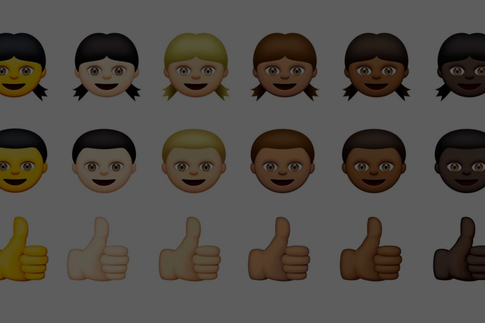

---

###The Future of Computing - Building at Unprecedented Scale:

- Machine learning

- Big Data

- Web Services

- Security Infrastructure

- ...and more!

---

###For the first time in history we are learning what it means to design and engineer products for everyone the world.

---


---

- Bad People

- Bad Computers

---

> “You can’t ever reach perfection, but you can believe in an asymptote toward which you are ceaselessly striving.” 

__- Paul Kalanithi, When Breath Becomes Air__

---

#Thank you.

Questions?

---

#Thank you.

@tcburning (Twitter)

tcburning@gmail.com

---

Sources

[Why Carmakers Always Insisted on Male Crash-Test Dummies](https://www.bloomberg.com/view/articles/2012-08-22/why-carmakers-always-insisted-on-male-crash-test-dummies)

[Is an algorithm any less racist than a human?](https://www.theguardian.com/technology/2016/aug/03/algorithm-racist-human-employers-work)

Screenshots of articles reference their source.
