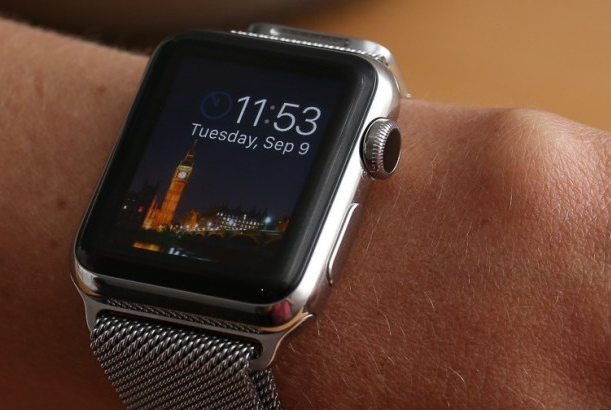
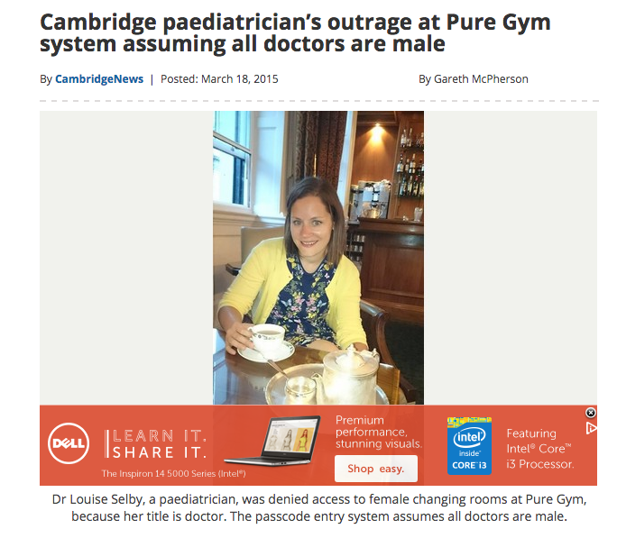
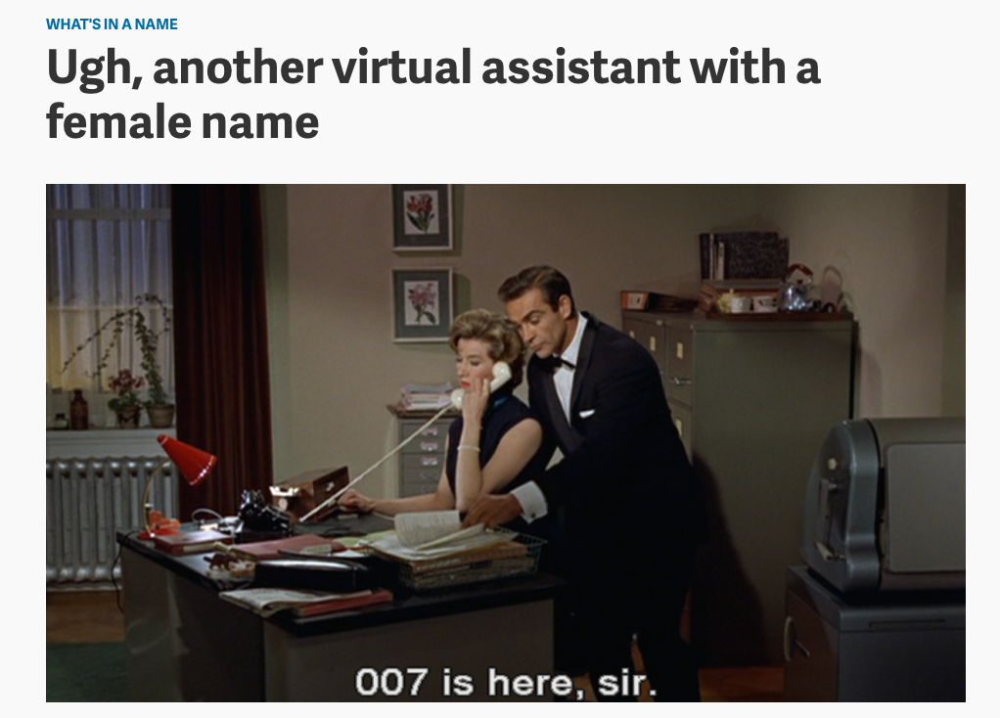
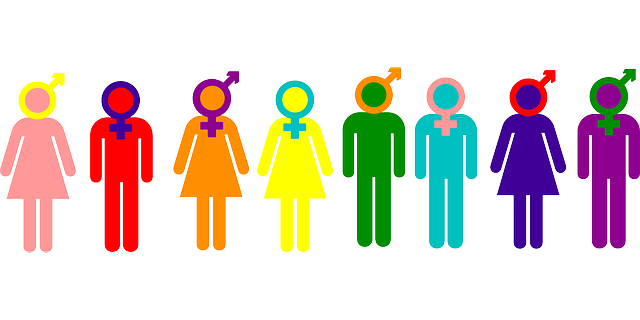
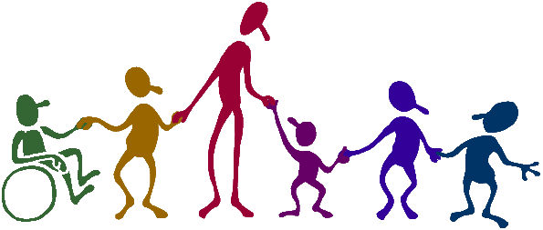
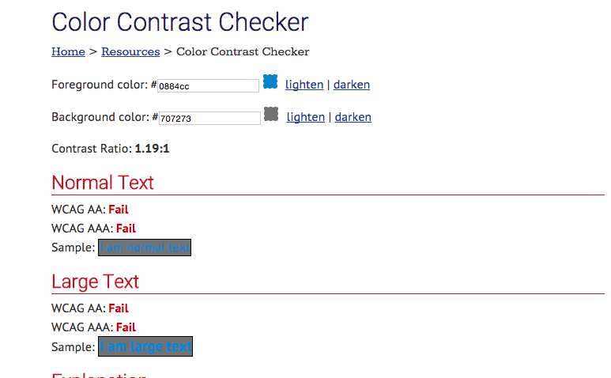

#Building Inclusive Technologies

^This is important to me because 
^I’ve seen how discouraging exclusive technologies can be for users
^As a dev evangelist, I work to bridge gaps between tech + non-tech communities and this talk applies to everyone 
^IT’S HARD: I realize how time consuming, exhausting, overwhelming, and to be honest nearly impossible it is to make every single person feel included all the time
^So hopefully by the end of this talk I can provide a some words of encouragement and tips on how to do this better

---

^Having diverse teams is important and highly related to this topic. 
^I could talk about that for forever (and message me if you’d like to!) but I’m going to focus more on diverse consumers rather than producers
^I’m going to give some examples (some real, some hypothetical) of barriers that get built into technologies that isolate certain groups and talk about how we can be more inclusive
^And of course relate this all to Venmo

---

What do I mean making more inclusive technologies?

^Q for the audience

---

#Why?

---

The fact is, you want as many people using your product as possible. 

---

There's value in making other people feel good.

^As proven by 'scientific studies'

---

#Some examples!

---

#HP

---

^Statement from HP: "We are working with our partners to learn more. The technology we use is built on standard algorithms that measure the difference in intensity of contrast between the eyes and the upper cheek and nose. We believe that the camera might have difficulty "seeing" contrast in conditions where there is insufficient foreground lighting."

---

#Apple

---

^tattoos and dark skin interfere with pulse readings

---

#Cambridge

---

---

#Facebook

---

---

My point: things like this happen all the time. You live and you learn, but you can also be proactive. 

---

#Things to consider

^going to speak generally now, and then relate to Venmo later

---

#Gender

^think about default pronouns and app uses
^think about options in sign up forms

---

#Abelism

^consider how inclusive apps may be for the disabled
^fun fact--I was a QA tester for the game dots and had to play in colorblind mode

---

#Geographic

^highly related to aforementioned considerations
^recognize that geographic differences may prevent certain groups from even knowing about an app
^or realizing why it may be useful
^ this is why outreach is important

---

#Race

^pretty straightforward IMO

---

#$$$

^huge problem for tech conferences
^some technology at $100/month might end up attracting (NYC specific) more men (women 70 cents/$1), more people from the upper east side, less people of color
^also related is the importance of non-technical team members of companies, who can structure marketing initiatives, BD relations like scholarships to help compensate for those diversity losses = bigger user base, more diverse user base, and you also look good to the community because you are doing good for the community

---

#...and a much, much more

---

#Inclusivity comes with *privilege*:

It takes time, money, strategy, and resources.

^not every company has this -- depending on age, funding, company size, etc--, and that’s okay.

^scalability

---

^some examples of things we can think about as we grow as a company

---

^not just thinking about functionality, but how enriching an experience is

^Web Content Accessibility Guidelines (WCAG) are part of a series of web accessibility guidelines published by the Web Accessibility Initiative (WAI) of the World Wide Web Consortium (W3C), the main international standards organization for the internet.
WCAG has three conformance levels (A-AA-AAA) because the success criteria are organised based on the impact they have on design or visual presentation of the pages.

---

#Blind users

---

#People without bank accounts

---

#People without smartphones

---

#Geography

^Battlehack Chicago

---

#Future features

^how referring to others in the social feed will impact inclusivity (gender, blocking, support)
^always working to ensure that Venmo is a safe place

---

#Action items:

--Quick turnaround for instances where people don't feel included

--Regularly talking about how inclusive we are being

--Considering inclusivity with new feature rollouts

---

