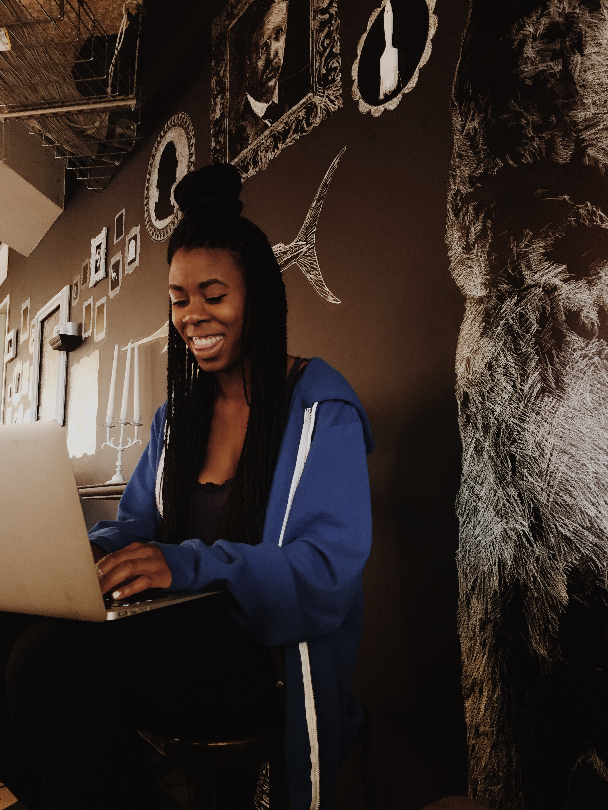
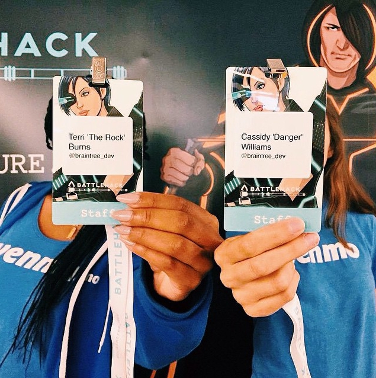

#My Developer Evangelism Internship at Venmo :sunflower: :smile: :joy: 

---

#About Me :thumbsup:

###about to be a senior at NYU :green_book:

###studying CS :computer:

###from Long Beach, CA :sunny:

###very big fan of Drake :sunglasses:

---

###What is developer evangelism?

^Now that my internship is over I figured this is the best time to tell you. Lol.

---

###I split my time between **development** and **outreach**.

###The idea: We recruit great talent, get developers building amazing technologies while incorperating Venmo, and do good for the tech community.

---

##Part One: (Front-End) Development

---

##Blog

###[Link](http://blog.venmo.com)

^squarespace in developer mode

^code written back in 2009 that needed to be refactored

^in its original state when I looked at it, the code was written so that if someone logged into the squarespace and tried to make certain basic edits to posts or the page they would have to rewrite the developer code, which isn’t ideal for marketing/people team who is primarily using the blog. their job is not to write code

^so my job was to 1) make it look better 2) better integrate the developer code so that the page could be somewhat mutable from the back-end interface without actually having to touch code

^this was very annoying. squarespace doesn’t allow you to preview your changes on a local file, so every change you made was actually being shipped. 

---

###`git revert`

^my best friend

---

#Venmo University

^will provide link once it's live

^marketing team has been talking about getting some sort of portal for students/recent grads who want to work at venmo. at Battlehack Chicago, I started working on a static web page that could be used for this purpose. 

^This is how I started learning React, which is the hot new javascript library for building interfaces. Probably the thing I most enjoyed learning this summer because it was interesting and made me feel cool.

^There still needs to be image and copy updates which will happen in the coming weeks so that is can go live

---

#Developer Site

^will provide link once it's live

^Redoing the entire API site

^Migrating mostly from Flask to React

---

##Part Two: Outreach :zap:

---

##aka... events! :dancer:

^I went to a lot. I am tired.

---

##**meetups**: hosting + attending :see_no_evil:

##**hackathons**: hosting + attending :elephant:

^The developer evangelist role doesn't really "end," as long as I work at Venmo my work will be associated with Venmo and that's something I need to be congnizant of and take advantage of.

---

#(hosting) meetups :tulip:

---

##**Women in Tech**
##**Intern Meetup**

^Women in tech was my favorite. More people showed up it was a really exciting demographic.

---

#(attending) meetups :egg:

---

###**NYT Meetup**
###**Manhattan.JS**
###**Betterment (Cassidy spoke on Imposter Syndrome!)**

^All meetups I recommended going to!

---

#(hosting) hackathons :camera:

^using the term hosting loosely, more so meaning helping out in some capacity vs actually competing

---

##**Code 2040**

##**AngelHack BK**

##**Battlehack Chicago**

##**Black Girls Code**

##**Coalition for Queens (rainbow pic in #victory)**

##**Battlehack NYC**

^volunteering--not always on behalf of Venmo, and not always in a technical capacity

---

#(attending) hackathons :loudspeaker:

---

##**DevPost!**

##**UN hackathon**

---

#Speaking :microphone:

##**Ladies@Launch**

##**Lunch n Learn here @ Venmo**

^speaking at Venmo was the event that made me most nervous 

---

#Miscellaneous :strawberry:

##**Who's Who Branding**

##**Podcast**

##**Epic Music Video**

^Link to music video here: https://www.youtube.com/watch?v=UEr0KuEFWog&feature=youtu.be

---

##Thank you all for a great summer :heart::heart::heart:
