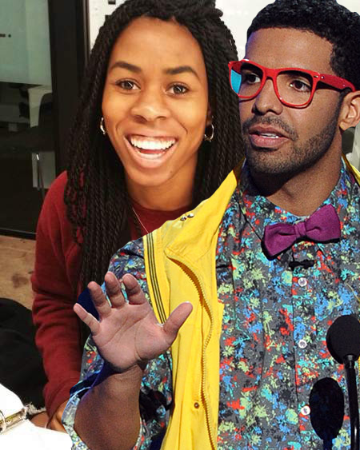

#[fit]Drake's Next Big Hit

---

##github.com/terriburns/Drakes-Next-Big-Hit

^ The world at the intersection of code and Drake (very important)

---

#A Drake Lyric Generator

^What I'm attempting to do (and still working on) is to create a lyric generator. Word generators are pretty hard.

^Can we train a corpus to produce text that could have reasonably been written by Drake?

---

#The difficulties

1. Subjective... what does "sounding like Drake" mean?

2. It's hard to make computers sounds like humans (Turing test)

3. Limited time in general

---

#A little NLP Vocabulary :green_book:

1. NLP

2. Corpus

3. NLTK

4. POS tagging

---

^That was probably boring so I wanted to make up for it with a cute picture of baby Drake.
