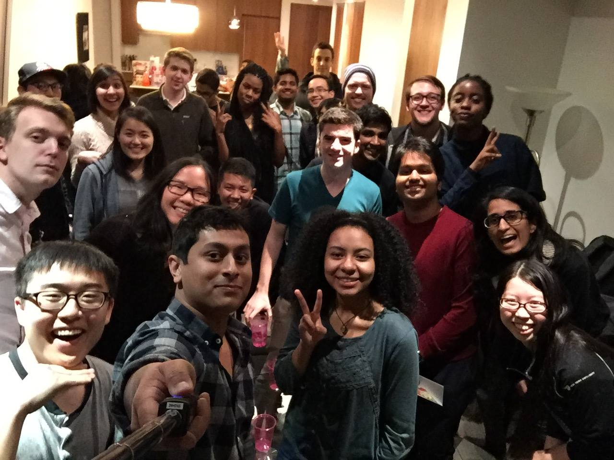

#[fit]Tech@NYU President 2015-2016

^Talking about presidency

^Why it's important

^What I do

^What tech@nyu needs

^The future of this club

^The election process

---

What do I even do?

---

Overseeing :eyes: 

^Overseeing everything. Providing transparency when necessary, and opacity when necessary.

^You all don't need to know of everything that goes on, but there are some things that everyone needs to know about.

---

Organizing/community building

^Our weekly meetings -- deciding when we need to get stuff done, when we need a team boost

^Planning our retreat (not logistics, but community building, figuring out which games to play, etc)

---

Spearheading the execution of initiatives that other board members want so see happen

^Using discuss

^Helping motivate teams

^Infra checkins

---

Putting out fires :fire:

^Tech@NYU finances

^Orgsync weirdness

^Emotion

^Frienship

---

Misc

^Meetings, phone calls

---

How it's changed me

---

The election process

^Meeting with people you don't know well/everyone

^Giving a talk on what you want for the future of this club

^Voting day -- an intense day, but a really great way for us to prioritize the future of this club, align our values, and get excited about the future

---

???

^hmu
