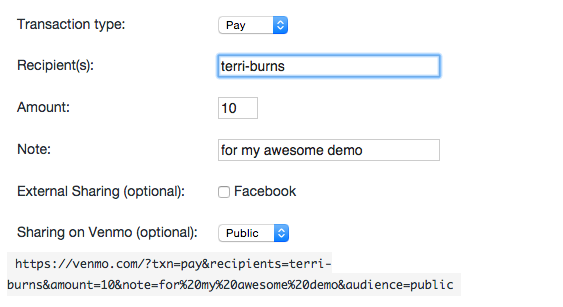
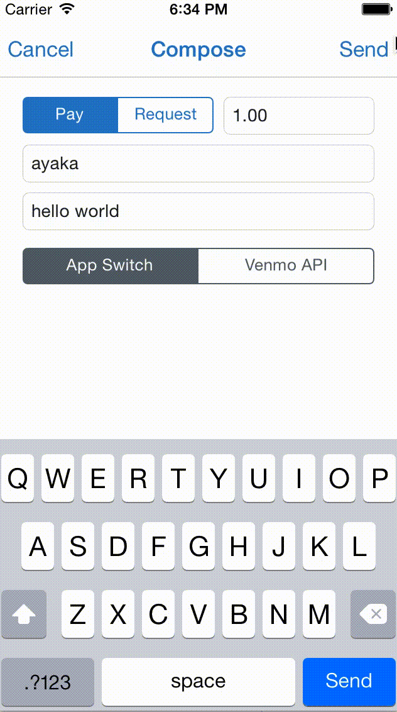

#venmo developer api

###**using venmo to make your apps even better**

^special thanks to Cassidy Williams for helping me with this! You're great.

---

using the developer api is super easy :smile: :+1:

---

there are **three main** ways to use the api:

1. payment links

2. REST api/OAuth

3.Drop ins (iOS + Android) 

---

but back to the two main ways!

let's talk about the first: 

#**payment links**

---

  ---

  **so simple it's almost absurd**

  ---

  let's talk about the second:  

#**REST api/OAuth**

  ---

  DEMO TIME :dancer:

  ---
there is a third way, that i'll touch on quickly...

**Drop ins for iOS and Android**

---

---

#### 1. Create your app on Venmo

#### 2. Configure your Xcode project

#### 3. Initialize the Venmo iOS SDK

#### 4. Choose a transaction method

#### 5. Request permissions

#### 6. Send a payment

^We recommend using CocoaPads for iOS
Moving away from focusing on "drop ins" aka the iOS and android SDKs (for now)

---

*android is just as easy*

for more info...  

#**github.com/venmo**

---

  we also have a **sandbox** for you to use when testing payments so you don't go broke. that said, if for whatever reason you'd like to practice sending payments to **me** by all means be my guest!

  ---

  all of this and more can be found at  

#**developer.venmo.com**

  ---

  for more resources like code samples, tutorials, and working examples, visit  

#**github.com/venmo**

  ---

  :sunny::100::bread:

  **terri@venmo.com** / **@tcburning**

  ---

  you are all :star:s. good luck!

